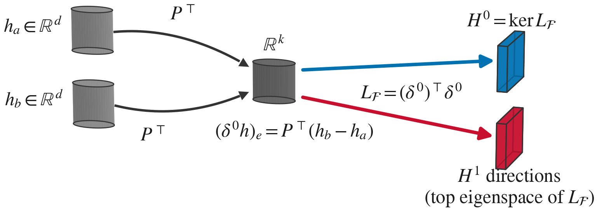

# NeurIPS 2026: Gluing Local Contexts into Global Meaning: A Sheaf-Theoretic Decomposition of Transformer Representations

<p align="center">
  <a href="https://bryceag11.github.io"><b>Bryce Grant</b></a>, <a href="https://scholar.google.com/citations?user=4CbVWDcAAAAJ&hl=en"><b>Peng Wang</b></a><br>
  Case Western Reserve University
</p>

<p align="center">
  <a href="https://cwru-aism.github.io/gluing-lc-page/static/paper.pdf"></a>
  <a href="https://cwru-aism.github.io/gluing-lc-page/"></a>
  <a href="LICENSE"></a>
</p>

<p align="center">
  
</p>

Paraphrase pairs glue into a cellular sheaf on a frozen model's hidden states. Its Laplacian splits them into H<sup>0</sup>, content that is stable across phrasing, and H<sup>1</sup>, the directions that vary with context.

- **H<sup>0</sup> is a content subspace:** at 20 dimensions it beats LEACE on held-out CounterFact retrieval across eight models (mean +17.1 pp).
- **H<sup>1</sup> carries causal influence:** ablating its coordinates changes model output 5.6–26.5× more than variance-matched controls across nine models.
- **Harmonic mass tracks steering fragility:** it orders six architectures as their fragility under random steering does (Spearman ρ = 0.90, p = 0.014).

## Installation

```bash
git clone https://github.com/CWRU-AISM/gluing-lc.git && cd gluing-lc
pip install -e ".[llm]"    # library only: pip install -e .
```

## Quick Start

```python
import torch
from sheafint import ScalableSheaf, fit_h0_pca

# Mean-pooled hidden states of paraphrase pairs (random stand-ins here).
h_a = torch.randn(200, 768)
h_b = h_a + 0.05 * torch.randn_like(h_a)

h0 = fit_h0_pca(h_a, h_b, k=20, edge_dim=128)   # (768, 20) content basis

sheaf = ScalableSheaf(edge_dim=16, device='cpu')
sheaf.fit({'a': h_a, 'b': h_b}, {('a', 'b'): torch.arange(200)})
print(sheaf.compute_cohomology())               # {'H0_dim': ..., 'H1_dim': ..., ...}
```

## Experiments

```bash
python experiments/topology.py grid --model gpt2                              # Table 1
python experiments/retrieval.py leace --model mistralai/Mistral-7B-v0.1       # Table 2
python experiments/causal.py coordinates --model microsoft/phi-2              # Table 3
python experiments/steering.py counterfact --model mistralai/Mistral-7B-v0.1  # Table 4
```

`--help` lists each entry point's experiments and flags. See [docs/REPRODUCTION.md](docs/REPRODUCTION.md) for the command behind each table.

## Repository Structure

```
gluing-lc/
├── sheafint/            # Library
│   ├── core/            # Sheaf construction, cohomology, Hodge decomposition, holonomy
│   ├── data/            # Templated relation facts
│   └── steering/        # Restriction maps, sheaf and Fisher decompositions, steering vectors
├── experiments/
│   ├── retrieval.py     # Held-out fact retrieval
│   ├── topology.py      # Cohomology and harmonic mass
│   ├── causal.py        # Ablations
│   ├── steering.py      # CounterFact steering
│   └── utils/           # Shared data, model, retrieval, Hodge and statistics helpers
├── docs/REPRODUCTION.md # Reproduction guide
└── tests/               # Smoke tests
```

## Citation

```bibtex
@inproceedings{grant2026gluing,
  title     = {Gluing Local Contexts into Global Meaning: A Sheaf-Theoretic Decomposition of Transformer Representations},
  author    = {Bryce Grant and Peng Wang},
  booktitle = {Advances in Neural Information Processing Systems},
  year      = {2026},
  url       = {https://cwru-aism.github.io/gluing-lc-page/}
}
```

## License

[MIT](LICENSE)
